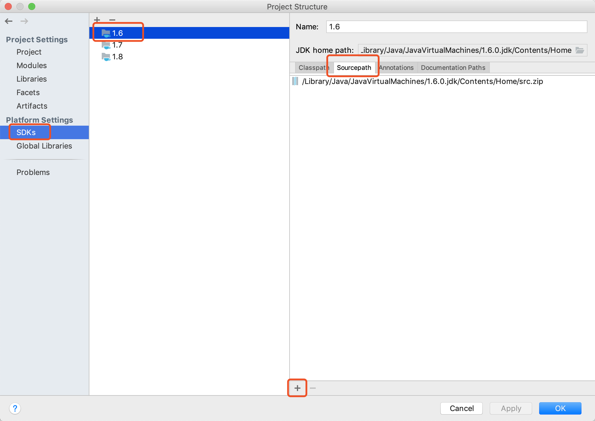

本项目主要阅读的是JDK1.6的源码（逻辑层数少一些，部分地方会与JDK1.7、1.8做对比。但主要还是调试1.6的代码）

JDK for Mac的下载地址：[https://support.apple.com/kb/DL1572?viewlocale=en_US&locale=en_US](https://support.apple.com/kb/DL1572?viewlocale=en_US&locale=en_US)  
备用地址：[JDK1.6_for_mac](https://tb.nsfocus.co/file/jdk1.6_for_mac.dmg)  
下载src.zip源码：[JDK1.6_src.zip](https://tb.nsfocus.co/file/jdk1.6_src.zip)

关联源码：



生成JavaDoc：  
Tools -> Generate JavaDoc  
Other command line arguments: ```-encoding UTF-8 -charset UTF-8```  
