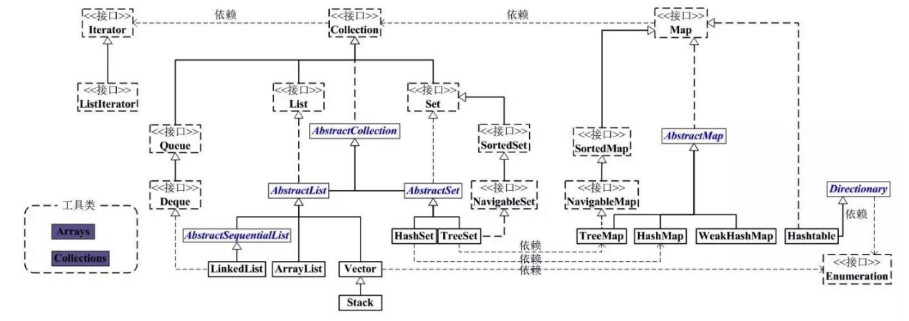
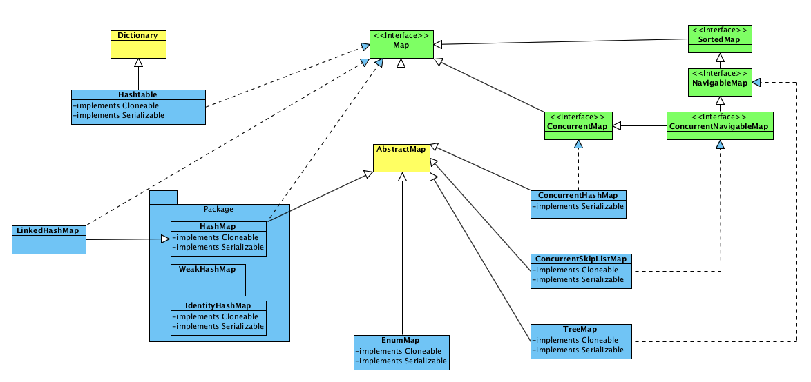

# 接口继承关系


# Map


## HashMap
是根据key的hashCode来存储数据，因此get和put的时间复杂度为O(1)，但遍历的顺序是不确定的。  
key和value都允许为null，  
HashMap的非线程安全的，多个线程可以同时操作一个HashMap，因此会出现数据不一致的场景。
可以使用Collections.synchronizedMap方法使HashMap具有线程安全的能力，或者直接使用ConcurrentHashMap。

```
 Map m = Collections.synchronizedMap(new HashMap());
      ...
  Set s = m.keySet();  // Needn't be in synchronized block
      ...
  synchronized(m) {  // Synchronizing on m, not s!
      Iterator i = s.iterator(); // Must be in synchronized block
      while (i.hasNext())
          foo(i.next());
  }
```
影响HashMap性能的两个重要参数：
 - capacity（初始容量为16）当前数组的容量。当容量达到负载因子的阈值时，会扩容为当前容量的2倍。
 - loadFactor（默认0.75）
数组的Entry包含四个属性：key, value, hashCode, next。

1.7及以前采用的是数组+链表的设计。
1.8以后，当Entry的链表元素超过8个时，会将链表转换为红黑树。

## ConcurrentHashMap
整个 ConcurrentHashMap 由一个 Segment 数组组成，Segment 通过继承 ReentrantLock 来进行加锁，所以每次需要加锁的操作锁住的是一个 segment，这样只要保证每个 Segment 是线程安全的，也就实现了全局的线程安全。  
每个segement内部实现与HashMap类似，ConcurrentHashMap的concurrencyLevel（默认16），即理论上最多可以支持16个线程同时操作这个ConcurrentHashMap。  
concurrencyLevel可以在初始化时设置为其他值`ConcurrentHashMap concurrentHashMap = new ConcurrentHashMap(ConcurrentHashMap.DEFAULT_INITIAL_CAPACITY, ConcurrentHashMap.DEFAULT_LOAD_FACTOR, 20);`，但是一旦初始化之后就不可以更改了
 
put 操作： 
 
        segmentShift = 32 - sshift;     //32 - 4 = 28（2 ^ sshift = concurrencyLevel）
        segmentMask = concurrencyLevel - 1;        //16 - 1 = 15
        //先找到segment段的hash
        segmentHash = (hash >>> segmentShift) & segmentMask
        //HashMap.put(key, hash, value)

## Hashtable
Hashtable是一个遗留类，它内部实现与HashMap类似。
区别是：1. Hashtable的key和value都不允许为null。2. Hashtable的每一个方法都由synchronized修饰，即Hashtable是线程安全的（同一时刻只允许一个线程操作Hashtable）
因此Hashtable的并发性没有ConcurrentHashMap。
所以在代码中很少使用，并发场景使用ConcurrentHashMap，不需要线程安全的场景一般使用HashMap。

## LinkedHashMap
LinkedHashMap 是 HashMap 的一个子类，它将key的hash数组改成了一个双向链表从而实现了可以记录每一个元素的插入顺序。使用Iterator遍历时，会安装插入顺序返回每个元素。  
也可以在在初始化时带参数`LinkedHashMap linkedHashMap = new LinkedHashMap(16,  0.75f, true);` 使迭代时按访问顺序迭代（LRU）。

## TreeMap
TreeMap 实现了 SortedMap接口，默认根据键值的升序排序。也可以在初始化时通过指定Comparator，来指定排序顺序：
```
        TreeMap<Integer, Integer> treeMap = new TreeMap(new Comparator<Integer>() {
            public int compare(Integer o1, Integer o2) {
                return o1-o2;
            }
        });
```
适合非多线程情况加的有序Map场景。并发度较低的时，可以使用Collections.synchronizedSortedMap进行包装，也能提供较好的效率。

## ConcurrentSkipListMap
JDK1.6之后引入的ConcurrentSkipListMap。它是将元素的Key基于SkipList的方式进行排序。因此get/put/remove/constainsKey等操作的时间复杂度为O(logN)。  
不允许key value为空。  
没有size变量，因此在调用size()方法时，会遍历整个SkipList，时间复杂度O(N)。  

因此 ConcurrentSkipListMap 适合处理高并发也需要对Map键值进行排序的场景。