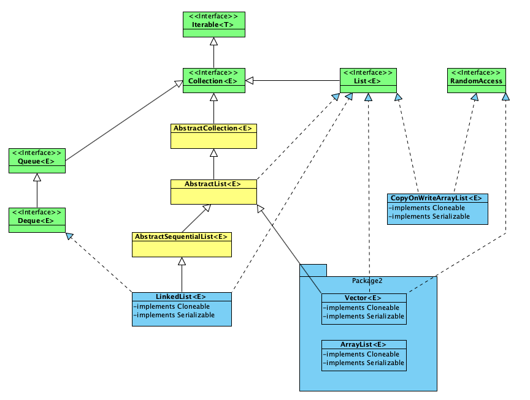

# List

## ArrayList
ArrayList是一个可变长数组，初始化capacity = 10。
扩容策略：
JDK1.6：`newCapacity = (oldCapacity * 3)/2 + 1`          // old * 1.5 + 1  
JDK1.7+：`newCapacity = oldCapacity + (oldCapacity >> 1)` // old * 1.5  
每一次扩容 都要将旧数组拷贝到新数组中。(System.arraycopy)

当想要在中间位置插入/删除元素时，都会需要将index后面的数据往前移动一位（ArrayList的每个元素之间不允许有间隔）。代价较高，因此ArrayList仅适合按下标随机查找和遍历，不适合插入和删除。

## Vector
Vector与ArrayList一样，也是一个可变长数组。Vector是线程安全的，类似于Hashtable，同一时刻只允许有一个线程操作它（内部方法被synchronized修饰了）。

## LinkedList
LinkedList是一个链表，提供了一些可以直接操作表头和表尾元素的方法，因此可以用来当做栈、队列、双向队列来使用。  
push() == addFirst()

## CopyOnWriteArrayList
CopyOnWrite，在写的时候会把数据复制一份出来，供其他线程来读。适用于写操作比较少，且能够容忍短暂的读写不一致的高并发场景。
