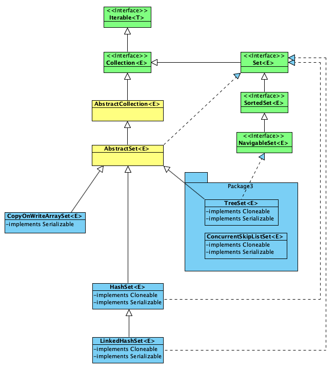

# Set

## HashSet
HashSet的内部是一个HashMap，add操作时，直接调用的`map.put(e, PRESENT)`方法。即如果元素不存在 则直接将其添加进map中，如果元素已存在则return false;

## TreeSet
TreeSet的内部是一个TreeMap，它继承了SortedMap，因此在迭代TreeSet时，出来的元素默认是按升序排好序的。  
Integer和String对象可以进行默认的TreeSet排序，如果是自定义的对象，**则必须实现Comparable接口，并覆盖CompareTo()函数**，才可以正常使用。

## ConcurrentSkipListSet
ConcurrentSkipListSet内部基于ConcurrentSkipListSet，因此它适合高并发环境下的有序集合。

## LinkedHashSet
LinkedHashSet继承自HashSet，但是他是基于LinkedHashMap实现的。因为HashSet为LinkedHashMap专门写了一个 初始化LinkedHashMap的方法。  
但LinkedHashSet的迭代时，只能按照插入顺序迭代。

## CopyOnWriteArraySet
CopyOnWriteArraySet内部基于CopyOnWriteArrayList实现的。只是CopyOnWriteArraySet内部的元素是不重复的。  
它同样是线程安全的，适用于写操作比较少，且能够容忍短暂的读写不一致的高并发场景。